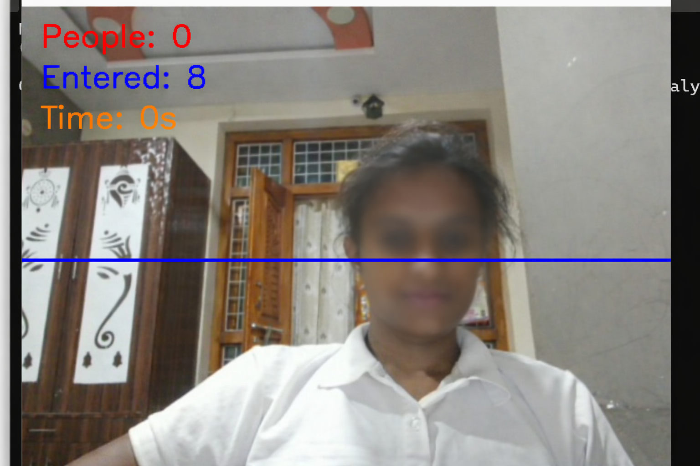

# Smart CCTV Behaviour Analysis

A Python and OpenCV based smart surveillance project that detects people from a webcam feed and analyzes customer behaviour.

## Features
- Person detection
- Bounding box display
- People counting
- Time tracking
- Entry counting
- Line crossing detection
- CSV event logging

## Technologies Used
- Python
- OpenCV
- NumPy
- CSV

## Main File
Run the main project using:

```bash
python smart_cctv_main.py

## Future Improvements
- YOLO-based person detection
- Face detection
- Entry and exit tracking
- Analytics dashboard
## How to Run the Project

1. Install required libraries:
```bash
pip install -r requirements.txt
Added usage instructions to README
## Use Cases
- Retail store monitoring
- Customer behavior analysis
- Smart surveillance systems
## Output Screenshot

## Project Highlights
- Real-time person detection using OpenCV
- Customer entry tracking using line crossing logic
- Time tracking of individuals in frame
- CSV-based logging for analytics
- Modular Python scripts for scalability

## Author
Manasa Kundanapally
